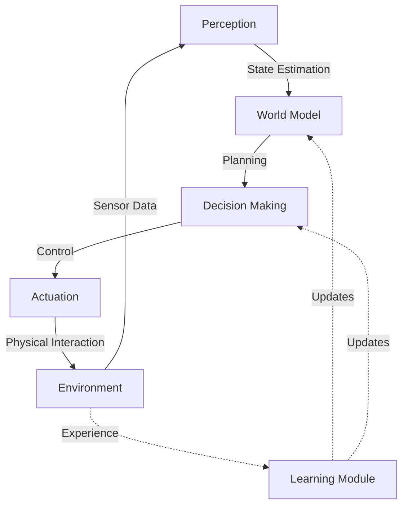

# Chapter 1: Introduction to Physical AI

## Introduction

**Physical AI** represents a fundamental paradigm shift in artificial intelligence—from systems that exist purely in digital space to intelligence that is **embodied**, **situated**, and capable of **acting** in the physical world. While traditional AI excels at pattern recognition, language processing, and game playing, Physical AI must navigate the complexities of real-world physics, uncertainty, and continuous sensorimotor interaction.

This chapter explores the foundations, challenges, and opportunities of building intelligent systems that bridge the digital-physical divide.

---

## 1. The Paradigm of Embodied Intelligence

### 1.1 From Disembodied to Embodied AI

Traditional AI systems operate in abstract, symbolic domains:
- **Chess engines** manipulate board states
- **Language models** process text tokens  
- **Image classifiers** analyze pixel arrays

**Physical AI systems** must:
- Perceive the world through **noisy sensors**
- Act through **imprecise actuators**
- Operate under **physical constraints** (gravity, friction, inertia)
- Handle **irreversible consequences** of actions

### 1.2 The Embodiment Hypothesis

> **Embodiment Hypothesis**: Intelligence is fundamentally shaped by the physical form and sensorimotor capabilities of an agent.

**Key Insight**: Cognition emerges from the dynamic interaction between brain, body, and environment—not from abstract symbol manipulation alone.

**Example**: A robot learning to grasp must develop intuitions about:
- Object weight distribution (physics)
- Surface friction (materials science)
- Gripper compliance (mechanical engineering)

These intuitions cannot be learned from text alone—they require **physical experience**.

---

## 2. Historical Context

### 2.1 Timeline of Physical AI

| Era | Milestone | Significance |
|-----|-----------|--------------|
| **1960s** | Shakey the Robot (SRI) | First mobile robot with AI planning |
| **1980s** | Brooks' Subsumption Architecture | Behavior-based robotics, reactive control |
| **2000s** | DARPA Grand Challenge | Autonomous vehicles in unstructured environments |
| **2013** | Boston Dynamics Atlas | Dynamic humanoid locomotion |
| **2016** | AlphaGo → AlphaZero | Transfer learning to physical domains |
| **2020s** | Tesla Optimus, Figure 01 | Commercial humanoid robots with AI |

### 2.2 The Three Waves of AI

1. **First Wave (1950s-1980s)**: Symbolic AI, expert systems
2. **Second Wave (1990s-2010s)**: Statistical learning, deep neural networks
3. **Third Wave (2020s+)**: **Physical AI** - embodied, contextual, adaptive

---

## 3. Core Challenges of Physical AI

### 3.1 The Reality Gap

**Problem**: Models trained in simulation often fail in the real world.

**Causes**:
- Simplified physics in simulators
- Sensor noise not accurately modeled
- Material properties (friction, elasticity) differ

**Solutions**:
- **Domain randomization**: Train on diverse simulated environments
- **Sim-to-real transfer**: Fine-tune on real-world data
- **Digital twins**: High-fidelity simulation of specific robots

### 3.2 Sample Efficiency

**Problem**: Physical robots cannot collect millions of training examples like software agents.

**Constraints**:
- Real-time operation (no fast-forward)
- Wear and tear on hardware
- Safety concerns (robot damage, human injury)

**Solutions**:
- Transfer learning from simulation
- Meta-learning (learning to learn)
- Human demonstrations (imitation learning)

### 3.3 Safety and Robustness

**Problem**: Physical actions have irreversible consequences.

**Requirements**:
- **Collision avoidance**: Never harm humans or property
- **Graceful degradation**: Handle sensor/actuator failures
- **Interpretability**: Explain decisions for high-stakes actions

---

## 4. Key Components of Physical AI Systems



**Figure 1.1**: The perception-action loop in Physical AI systems

### 4.1 Perception

**Sensors**:
- Cameras (RGB, depth, thermal)
- LiDAR (3D point clouds)
- IMUs (acceleration, angular velocity)
- Force/torque sensors

**Processing**:
- Object detection and segmentation
- Pose estimation
- Scene understanding

### 4.2 World Modeling

**Purpose**: Maintain an internal representation of the environment.

**Approaches**:
- **Geometric**: 3D maps, occupancy grids
- **Semantic**: Object categories, relationships
- **Predictive**: Forward models of dynamics

### 4.3 Planning & Decision Making

**Levels**:
1. **Task planning**: High-level goal decomposition
2. **Motion planning**: Collision-free trajectories
3. **Control**: Low-level actuator commands

### 4.4 Learning

**Paradigms**:
- **Supervised**: Learn from labeled demonstrations
- **Reinforcement**: Learn from trial and error
- **Self-supervised**: Learn from raw sensory data

---

## 5. Case Study: Tesla Optimus

### 5.1 System Architecture

**Hardware**:
- 28 actuators (12 DOF arms, 12 DOF legs, torso, neck)
- Vision-only perception (8 cameras, no LiDAR)
- Onboard compute (Tesla FSD chip)

**Software**:
- **Perception**: Occupancy networks (3D scene reconstruction)
- **Planning**: Model Predictive Control (MPC)
- **Learning**: Imitation learning from human teleoperation

### 5.2 Key Innovations

1. **End-to-end learning**: Direct mapping from pixels to actions
2. **Sim-to-real transfer**: Trained in Isaac Gym, deployed on hardware
3. **Rapid iteration**: Leverage automotive AI infrastructure

### 5.3 Challenges

- **Generalization**: Works in structured environments, struggles with clutter
- **Dexterity**: Manipulation lags behind locomotion
- **Autonomy**: Still requires human oversight for complex tasks

---

## 6. The Future of Physical AI

### 6.1 Emerging Trends

**Foundation Models for Robotics**:
- Pre-trained on massive robot datasets
- Fine-tuned for specific tasks
- Examples: RT-2 (Google), PaLM-E (Google)

**Multimodal Learning**:
- Combine vision, language, and action
- Enable natural language task specification
- Example: "Pick up the red mug and place it on the shelf"

**Swarm Robotics**:
- Collective intelligence from simple agents
- Applications: Warehouse automation, search & rescue

### 6.2 Open Research Questions

1. How can robots learn common sense physics?
2. Can we achieve human-level dexterity in manipulation?
3. How do we ensure safety in human-robot collaboration?
4. What is the right balance between model-based and model-free learning?

---

## 7. Lab Activity: Simulating a Simple Physical AI Agent

### Objective
Implement a basic perception-action loop in a simulated environment.

### Tools
- **Simulator**: PyBullet (open-source physics engine)
- **Language**: Python 3.10+

### Task
Create a robot that:
1. Perceives its position via sensors
2. Plans a path to a goal
3. Executes motor commands
4. Handles obstacles

### Starter Code

```python
import pybullet as p
import pybullet_data
import numpy as np

# Initialize simulation
physicsClient = p.connect(p.GUI)
p.setAdditionalSearchPath(pybullet_data.getDataPath())
p.setGravity(0, 0, -9.81)

# Load environment
planeId = p.loadURDF("plane.urdf")
robotId = p.loadURDF("r2d2.urdf", [0, 0, 0.5])

# Perception: Get robot state
def get_robot_state(robot_id):
    pos, orn = p.getBasePositionAndOrientation(robot_id)
    return np.array(pos), np.array(orn)

# Control: Apply forces
def move_to_goal(robot_id, goal_pos):
    current_pos, _ = get_robot_state(robot_id)
    direction = goal_pos - current_pos
    force = direction * 10  # Proportional control
    p.applyExternalForce(robot_id, -1, force, current_pos, p.WORLD_FRAME)

# Simulation loop
goal = np.array([2.0, 2.0, 0.5])
for step in range(1000):
    move_to_goal(robotId, goal)
    p.stepSimulation()
    
p.disconnect()
```

**Exercise**: Modify the code to:
1. Add obstacle avoidance
2. Implement PID control instead of proportional
3. Visualize the robot's planned path

---

## 8. Summary

**Key Takeaways**:
- ✅ Physical AI extends intelligence into the real world through embodiment
- ✅ The reality gap, sample efficiency, and safety are core challenges
- ✅ Modern systems combine perception, planning, and learning
- ✅ Commercial humanoid robots (Tesla Optimus, Figure 01) demonstrate rapid progress
- ✅ Future advances will leverage foundation models and multimodal learning

---

## 9. Review Questions

1. **Conceptual**: Explain the embodiment hypothesis and provide an example of how physical form shapes intelligence.

2. **Technical**: What is the reality gap, and what are three strategies to mitigate it?

3. **Applied**: Compare symbolic AI (first wave) with Physical AI (third wave) in terms of representation, learning, and deployment.

4. **Critical Thinking**: Tesla Optimus uses vision-only perception. What are the advantages and disadvantages compared to LiDAR-based systems?

5. **Design**: You are building a robot for warehouse picking. List the key components of your Physical AI system and justify your choices.

---

## Glossary

- **Embodiment**: The physical instantiation of an intelligent agent in a body with sensors and actuators
- **Sim-to-real transfer**: Techniques for deploying models trained in simulation to real-world robots
- **World model**: An internal representation of the environment used for prediction and planning
- **Occupancy network**: A neural representation of 3D space indicating which regions are occupied
- **Model Predictive Control (MPC)**: An optimization-based control strategy that plans over a finite horizon

---

## References

1. Brooks, R. A. (1991). "Intelligence without representation." *Artificial Intelligence*, 47(1-3), 139-159.
2. Pfeifer, R., & Bongard, J. (2006). *How the Body Shapes the Way We Think*. MIT Press.
3. Kober, J., Bagnell, J. A., & Peters, J. (2013). "Reinforcement learning in robotics: A survey." *IJRR*, 32(11), 1238-1274.
4. Levine, S., et al. (2016). "End-to-end training of deep visuomotor policies." *JMLR*, 17(1), 1334-1373.
5. Tesla AI Day 2022: https://www.tesla.com/AI

---

**Next Chapter**: [Chapter 2: Humanoid Robotics Essentials](/docs/module-01/chapter-02) — Dive into the mechanical, electrical, and software components of humanoid robots.
